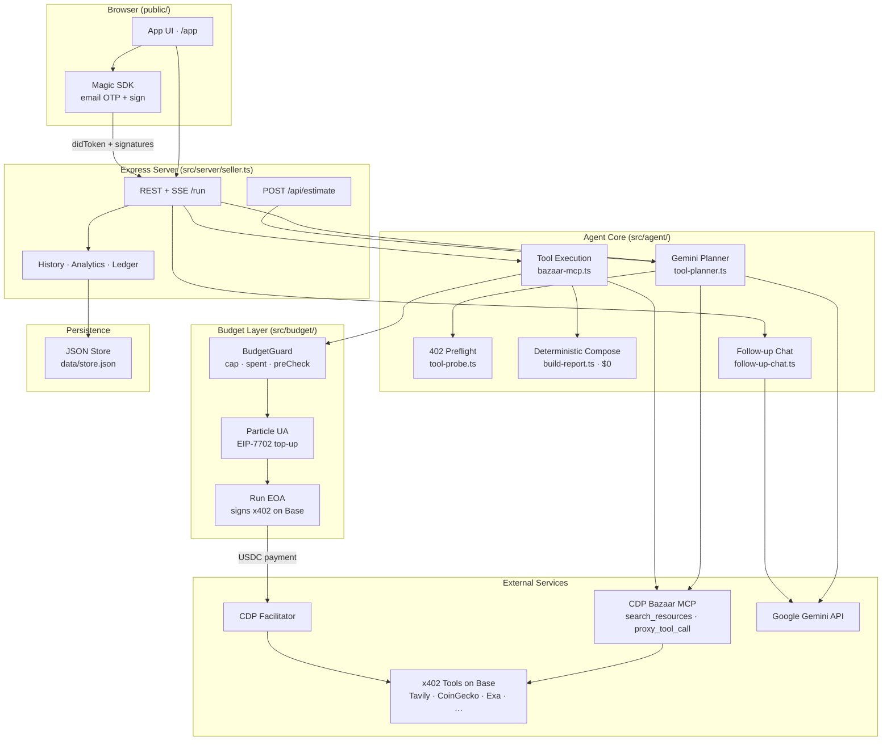

# x402 Agentic Orchestrator

**Pay-per-use AI agent that discovers, plans, and executes x402 micro-services — bounded by an on-chain USDC budget.**

Built for the [UXmaxx Hackathon](https://www.encodeclub.com/programmes/uxmaxx-hackathon) (Encode Club · 7702 Collective · Particle Network). The agent completes end-to-end research tasks by autonomously paying for CDP Bazaar MCP tools in USDC on Base, then assembles a structured deliverable from verified tool output.

| | |
|---|---|
| **Repository** | [github.com/Satianurag/x402-agentic-orchestrator](https://github.com/Satianurag/x402-agentic-orchestrator) |
| **Hackathon tracks** | Particle Universal Accounts (EIP-7702) · Magic embedded wallet · Arbitrum ecosystem |
| **Settlement** | Base mainnet USDC (`eip155:8453`) via CDP facilitator |
| **Runtime** | Node.js 22 · TypeScript · Express |

---

## Why this stack (July 2026)

This project sits at the intersection of three fast-moving open ecosystems:

| Ecosystem | July 2026 context | Role here |
|-----------|-------------------|-----------|
| **[x402](https://github.com/x402-foundation/x402)** | The x402 Foundation repo passed **6,000+ GitHub stars** in mid-2026 and is the open HTTP 402 micropayment standard (now stewarded by the [x402 Foundation](https://x402.org)). | Every paid tool call is a real `HTTP 402 → sign → retry` flow settled in USDC. |
| **[Model Context Protocol (MCP)](https://github.com/modelcontextprotocol)** | MCP ranked among the **top GitHub repositories and ecosystems in July 2026** as the standard for connecting AI agents to external tools. | Tool discovery and execution go through the official **CDP Bazaar MCP** (`search_resources` + `proxy_tool_call`). |
| **[CDP Bazaar](https://docs.cdp.coinbase.com/x402/bazaar)** | Coinbase's machine-readable discovery layer for x402 endpoints and MCP tools — the "search index" for agentic commerce. | The planner picks minimum-cost Bazaar tools per goal; the agent pays only for what it uses. |
| **UXmaxx Hackathon** | Encode Club · May–June 2026 · $12K+ prize pool · focus on Universal Accounts + EIP-7702 + consumer-grade UX. | Magic login (no seed phrase), Particle UA cross-chain top-up, and budget-bounded autonomous runs. |

The goal: make chains and payments disappear for the user while every spend remains provable on-chain.

---

## Features

- **Magic email login** — embedded wallet signs x402 payloads and EIP-7702 UA authorizations in the browser
- **Particle Universal Account** — cross-chain USDC top-up to the run EOA on Base when balance is below cap
- **Gemini planner** (`gemini-3.1-flash-lite`) — selects the minimum Bazaar MCP tools per goal with cost + capability reasoning
- **Live preflight probes** — `$0` HTTP 402 probes block runs when vendors are down before any payment
- **Budget guard** — `fundRunWallet()` → `preCheck()` → `recordSpend()` enforces per-run USDC cap (max $5.00)
- **Deterministic compose** — structured report built from paid tool JSON ($0, no LLM spend on deliverable)
- **Follow-up Q&A** — Gemini answers questions about a completed run without new tool payments
- **Resume checkpoints** — partial runs can resume without re-paying completed steps
- **Run history, analytics, and CSV ledger export**
- **Prebuilt + custom agents** — templates for market briefs, web monitoring, crypto research, and more
- **CLI mode** — headless runs with `PRIVATE_KEY` (no Magic UI required)

---

## Architecture



### Layer summary

| Layer | Component | Responsibility |
|-------|-----------|----------------|
| **Auth** | Magic | Email login; embedded wallet signs typed data for x402 and EIP-7702 |
| **Funding** | Particle UA | Unified USDC balance → cross-chain top-up to run EOA on Base |
| **Planning** | Gemini + Bazaar | Semantic tool discovery; minimum-cost plan with live 402 estimates |
| **Execution** | `@x402/mcp` | `wrapMCPClientWithPayment` — automatic 402 negotiation per `proxy_tool_call` |
| **Budget** | `BudgetGuard` | Cap enforcement before every signature; on-chain balance checks |
| **Deliverable** | Evidence IR | Deterministic report from tool JSON — facts, links, tables, spend ledger |
| **Seller** | `POST /synthesize` | Optional x402-gated synthesis endpoint (for external integrations) |

---

## How a run works

```
1. User logs in (Magic) and enters a goal (+ optional tool picks)
2. POST /api/estimate → Gemini plans minimum Bazaar tools; live 402 probes run
3. User reviews plan + budget on the plan card, then approves
4. fundRunWallet() — UA tops up Base EOA via EIP-7702 if USDC < cap
5. For each MCP step:
     proxy_tool_call → HTTP 402 → EOA signs → CDP settles → tool result
6. Compose step — deterministic report from collected evidence ($0)
7. Run saved to history with per-step tx hashes and explorer links
8. Optional follow-up Q&A on the deliverable (Gemini only — no new x402 spend)
```

Vague goals (`hi`, `test`, …) are rejected before planning. Runs that fail mid-way can resume from the last checkpoint without re-paying completed steps.

---

## Project structure

```
uxmaxx/
├── public/              # Landing page, app UI, client JS
├── src/
│   ├── server/          # Express app, health, payment middleware
│   ├── agent/           # Planner, run loop, Bazaar MCP, report builder
│   ├── budget/          # BudgetGuard, UA top-up orchestration
│   ├── wallet/          # Magic, Particle UA, EOA, sign bridge
│   ├── services/        # x402 client, HTTP retry, seller helpers
│   ├── store/           # JSON persistence (runs, agents, ledger)
│   ├── config/          # Chain IDs, USDC addresses, facilitators
│   └── cli.ts           # Headless CLI entrypoint
├── scripts/             # E2E, probe, budget, and integration tests
├── dev-harness/         # Optional local testnet proxies
├── render.yaml          # Render.com deployment blueprint
└── .env.example
```

---

## Tech stack

| Category | Technology |
|----------|------------|
| Runtime | Node.js 22, TypeScript, Express |
| Payments | `@x402/core`, `@x402/mcp`, `@x402/express`, `@x402/fetch` |
| Discovery | CDP Bazaar MCP, `@x402/extensions` |
| Wallet | Magic (`@magic-sdk/admin`), Particle UA SDK 2.0.3 (EIP-7702) |
| LLM | Google Gemini (`gemini-3.1-flash-lite`) — planning + follow-up only |
| Chain | viem, ethers 6 — Base mainnet USDC |
| Facilitator | Coinbase CDP (`@coinbase/cdp-sdk`) |

---

## Setup

```bash
git clone https://github.com/Satianurag/x402-agentic-orchestrator.git
cd x402-agentic-orchestrator
cp .env.example .env
# Fill: GEMINI_API_KEY, MAGIC_*, PARTICLE_*, CDP_*, BASE_RPC_URL, SELLER_PAY_TO
npm install
npm run typecheck
npm start
```

| URL | Purpose |
|-----|---------|
| `http://localhost:4020/` | Landing page |
| `http://localhost:4020/app` | Agent app (use **`localhost`**, not `127.0.0.1`, for Magic) |

### Required environment variables

| Variable | Description |
|----------|-------------|
| `GEMINI_API_KEY` | Google AI — planner + follow-up chat |
| `MAGIC_PUBLISHABLE_KEY` / `MAGIC_SECRET_KEY` | Magic embedded wallet |
| `PARTICLE_PROJECT_ID` / `PARTICLE_CLIENT_KEY` / `PARTICLE_APP_ID` | Particle Universal Account |
| `CDP_API_KEY_ID` / `CDP_API_KEY_SECRET` | CDP x402 facilitator |
| `BASE_RPC_URL` | Base RPC for balance checks and x402 (use Alchemy/QuickNode — not public `mainnet.base.org` in production) |
| `SELLER_PAY_TO` | Address that receives USDC on `/synthesize` |
| `SELLER_BASE_URL` | Public URL of this server (e.g. `http://localhost:4020`) |
| `NETWORK` | `sepolia` (default) or `mainnet` |

See [`.env.example`](.env.example) for the full list including testnet facilitator and dev-harness options.

---

## API overview

| Method | Path | Auth | Description |
|--------|------|------|-------------|
| `GET` | `/health` | — | Render health check |
| `GET` | `/api/config` | — | Magic publishable key + network config |
| `POST` | `/api/estimate` | — | Plan + cost estimate ($0) |
| `POST` | `/run` | Magic `didToken` | Execute agent run (JSON or SSE `stream: true`) |
| `POST` | `/run/stop` | — | Abort in-flight run |
| `POST` | `/run/sign` | — | Fulfill delegated sign request from browser |
| `POST` | `/api/follow-up` | — | Q&A on completed deliverable |
| `POST` | `/api/balance` | Magic | UA + EOA USDC balances |
| `GET` | `/api/history` | Magic | List past runs |
| `GET` | `/api/ledger/export.csv` | Magic | Download spend ledger |

---

## Testing

All estimate and smoke tests run at **$0** (no paid tool calls):

```bash
npm run test:estimate    # Bazaar MCP + LLM planner + goal validation
npm run test:e2e         # Server + plan smoke (no paid run)
npm run test:report      # Deterministic report builder
npm run test:budget      # Budget guard unit checks
npm run test:vendor      # Vendor error sanitization
npm run probe            # Live Bazaar discovery probe
```

Full paid run (requires funded wallet):

```bash
E2E_PAID=1 npm run test:e2e
```

---

## CLI

```bash
# Plan only ($0)
npm run cli -- --goal "BTC price with sources" --estimate-only

# Full run (spends USDC — requires PRIVATE_KEY in .env)
npm run cli -- --goal "Summarize latest ETH news" --budget 0.10

# Pin specific Bazaar tools
npm run cli -- --goal "..." --budget 0.15 --tool "web-search"
```

---

## Budget enforcement

Three layers prevent overspend:

1. **`fundRunWallet(cap)`** — Particle UA → Base EOA top-up when on-chain USDC is below the run cap
2. **`preCheck(quote)`** — blocks signature if quote exceeds remaining budget or on-chain balance
3. **`onPaymentRequested` buy-gate** — MCP session denies payments for tools not in the approved plan

Per-run budget is capped at **$5.00 USDC** server-side.

---

## Deployment

A [Render](https://render.com) blueprint is included in [`render.yaml`](render.yaml). Set all secrets in the Render dashboard (`MAGIC_*`, `PARTICLE_*`, `CDP_*`, `GEMINI_API_KEY`, `PRIVATE_KEY`, `SELLER_PAY_TO`, `BASE_RPC_URL`). Health check: `GET /health`.

---

## Design principles

- **No fallbacks** — tool discovery uses official CDP Bazaar MCP only; execution uses `@x402/mcp` `wrapMCPClientWithPayment` only
- **Pay for data, not prose** — the planner selects primary-source tools; deliverable composition is deterministic and free
- **Every payment is on-chain** — each paid step returns a tx hash with Basescan explorer links
- **Budget or die** — if payment fails or cap is exceeded, the run stops

---

---

Built for the [UXmaxx Hackathon](https://www.encodeclub.com/programmes/uxmaxx-hackathon) · [x402](https://x402.org) · [CDP Bazaar](https://docs.cdp.coinbase.com/x402/bazaar) · [Particle Network](https://particle.network) · [Magic](https://magic.link)
